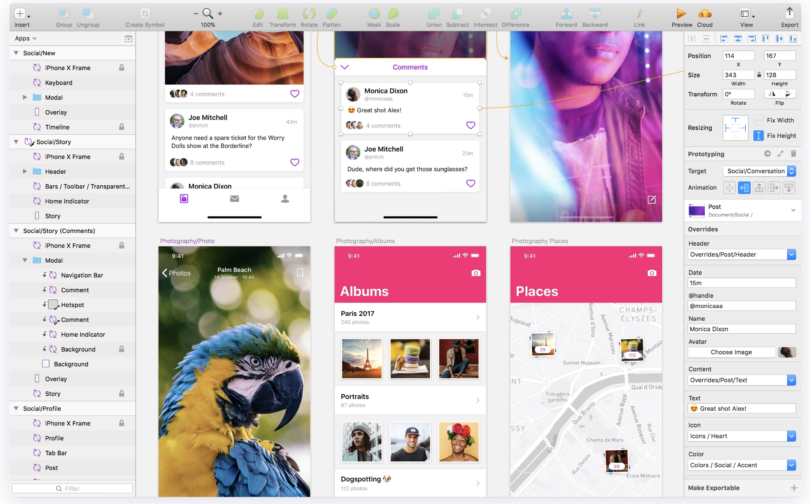

### Sketch & Ionic　について（アプリ開発R&Dの気づき）

- アプリ開発
- Sketch |
- Ionic |

+++

### Sketch


### インストール
* 完全ビルドとruntime-only ビルド
```js
module.exports = {
  // ...
  resolve: {
    alias: {
      vue : 'vue/dist/vue.esm.js'
    }
  }
}
```


+++


### 2枚目のスライド


---


### 3枚目のスライド


---


### END
