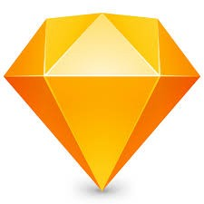
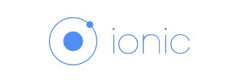

## Sketch & Ionic
### （アプリ開発R&Dの所感）

---
### アプリ開発R&Dにて
 #### ハイブリッドアプリを作りました。
<https://www.imjp.co.jp/dev/app/ionic/luncher/>
 
id: imj-dev
pw: creative
#### 新しいツール/フレームワークを使いました。
- Sketch ... デザインツール
- Invision ... プロトタイピングツール
- Ionic ... アプリ開発フレームワーク 

---
## Sketch

---
### Sketchとは
* Web・モバイルアプリに特化したデザインツール
* プロトタイプツールとしても使える(Sketch49~)

---
###  特徴（Photoshopとの違い）
- 軽い
- 拡張プラグインが豊富でカスタマイズ自由度が高い
- よりアプリ開発に特化している
  - 複数画面を1データで管理
  - コンポーネント（シンボル）を組み合わせる

---
### 使ってみた感想
- 効率的にマークアップできる (Sketch Measureプラグイン)
- 画像の書き出しが直感的
 
 
→エンジニア的には Sketchの方が作業しやすいと感じました。
 (デザイナーはメリット感じづらいらしい)

---
## Ionic

---
### Ionicとは
ハイブリッドモバイルアプリ制作のフレームワーク 
※ハイブリッドモバイルアプリ... 
[ハイブリッドアプリとは? - Qiita](https://qiita.com/soarflat/items/cf5d343c75baadb461dc)

---
### 特徴
* **Cordovaベース**
 - HTML5とJSでモバイルアプリが作れる
 ※Cordova...WebView+プラグインで ハイブリッドアプリを実現するフレームワーク
 - メリット、デメリットもCordovaに依存
* **ネイティブライクなUI部品が豊富**
 [Ionic Component Documentation](https://ionicframework.com/docs/components/#overview)
* **Angular, TypeScript を使用**

---
### 使ってみた感想
- **WEBと同じ感覚で実装できる**
- **Angular知らないと最初辛い**
  - TypeScript
  - モジュール構成、ディレクティブはAngularと同じ
- **ドキュメントが少ない**
  - 日本語の解説は少ない＆古い
  - 公式ドキュメントも情報乏しい＆更新頻度少ない
  - 困ったらだいたいStackOverflow

---
### アプリ開発の所感
- **Web開発のスキルセットでアプリは作れる！**
- **アプリ開発特有の知識が多少必要**
  - Xcode,AndrioStudioでのビルド
  - アプリ公開時の署名作成など
- **ネイティブ機能のフィジビリティは企画段階で確認すべき**

---
### END
